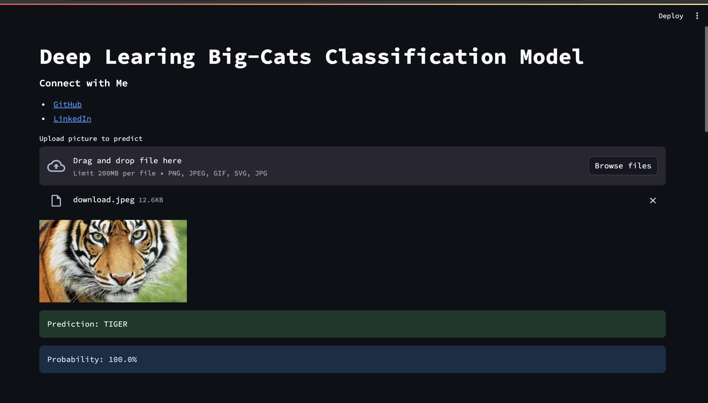

# Deep Learning Big-Cat Classification

## Streamlit Big Cats Classifier Deployment

Welcome to the Streamlit app for deploying our trained model that classifies 10 different kinds of big cats!

## About the Model
Our model has been trained using PyTorch and TensorFlow with Convolutional Neural Networks (CNNs). It has achieved an impressive accuracy of 100% on both PyTorch and TensorFlow frameworks, ensuring reliable performance.

## Dataset Preparation Toolkit
This app is more than just model deployment; it's an all-in-one toolkit for creating high-quality image datasets. Our custom set of tools assists in:
- Organizing downloaded images
- Filtering out irrelevant images
- Removing duplicates
- Cropping images to focus on the region of interest
- Resizing images for uniformity

## Model Training
We meticulously trained our model on a meticulously curated dataset consisting of images of 10 distinct types of big cats, including pumas, tigers, and others. The training process involved:
- Preprocessing the images using our toolkit to ensure uniformity and relevance
- Leveraging both PyTorch and TensorFlow frameworks for model training
- Utilizing Convolutional Neural Networks (CNNs) for image classification
- Fine-tuning the model parameters to achieve optimal performance

The rigorous training process, coupled with the robust dataset preparation, resulted in our model achieving an outstanding accuracy of 100% on both PyTorch and TensorFlow platforms.

## Model Deployment
Now, you can leverage the power of our trained model right here in this Streamlit app. Simply upload an image of a big cat, and our model will predict its class accurately.

### Instructions:
1. Upload an image using the file uploader.
2. View the predicted class along with the confidence score.

Feel free to explore and enjoy the seamless deployment experience!

